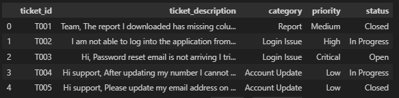
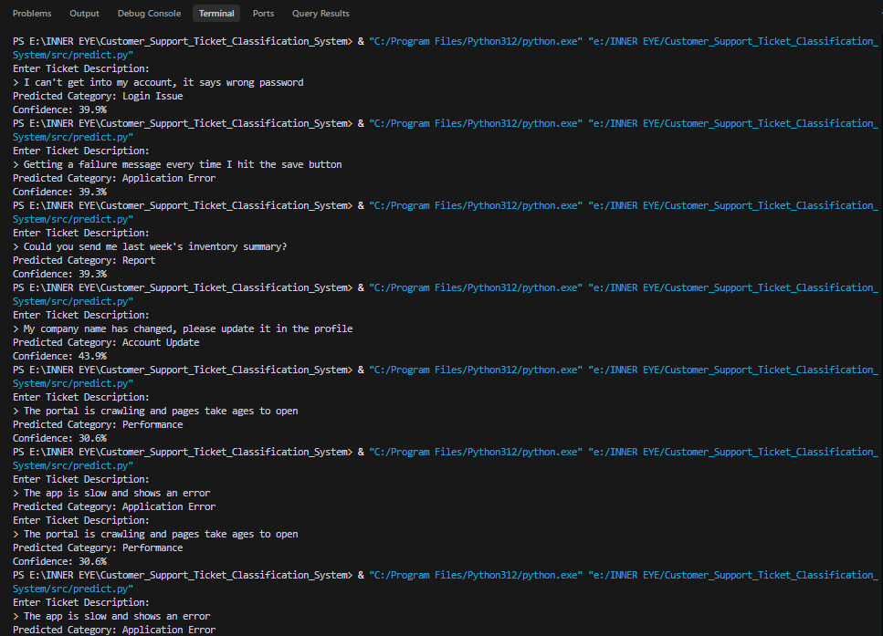

# Customer Support Ticket Classifier

## 1. Project Overview
This project automatically predicts the **category of a customer support ticket** from its text description. Descriptions are cleaned, converted into numeric features with TF-IDF, and classified by a Logistic Regression model. On a held-out test set the model reaches about **92.5% accuracy**.

## 2. Problem Statement
A company receives support requests through email, chat and other channels. Reading and routing each one by hand is slow, so the company wants the category of a new ticket predicted automatically from its description (for example "I forgot my password and cannot login" -> *Login Issue*).

## 3. Technologies Used
- Python 3.x
- pandas, NumPy (data handling)
- Matplotlib (charts)
- scikit-learn (TF-IDF, Logistic Regression, evaluation)
- joblib (saving and loading the trained model)

No libraries beyond the preferred list were used. Jupyter Notebook was used for the data preparation, analysis and training steps.

## 4. Dataset Information
- **File:** `dataset/claude_tickets.csv` (cleaned copy: `dataset/claude_tickets_cleaned.csv`)
- **Size:** 200 tickets, 5 categories, 40 tickets each: Login Issue, Application Error, Report, Account Update, Performance
- **Columns:** `ticket_id`, `ticket_description`, `category`, `priority`, `status`
- **Origin:** synthetic. Generated with `src/generate_dataset.py` from hand-written phrase templates with random openers, closers and extra details. About 20% of tickets per category are deliberately ambiguous (they mix vocabulary from other categories) to make the task more realistic. Priority is weighted by category and status is random, so neither is a real signal.


- **Public dataset evaluated first and rejected:** *Customer Support Ticket Dataset* (Kaggle, by suraj520), https://www.kaggle.com/datasets/suraj520/customer-support-ticket-dataset. On all 8,469 tickets, TF-IDF with Logistic Regression, Naive Bayes and Linear SVM each scored about 20% accuracy, which is random guessing for 5 classes. The ticket type label is unrelated to the ticket text, so it was not used.

## 5. Installation
```bash
python -m venv venv
venv\Scripts\activate          # Windows
# source venv/bin/activate     # Linux / macOS
pip install -r requirements.txt
```

## 6. Project Structure
```
AI_Assignment_Gopi/
├── dataset/
│   ├── claude_tickets.csv
│   └── claude_tickets_cleaned.csv
├── src/
│   ├── generate_dataset.py
│   └── predict.py
├── model/
│   ├── vectorizer.pkl
│   └── classifier.pkl
├── snaps/
├── notebook.ipynb
├── requirements.txt
├── README.md
└── report.pdf
```

## 7. Required Dependencies
See `requirements.txt` (pandas, numpy, matplotlib, scikit-learn, joblib).

## 8. How to Train the Model
Open `notebook.ipynb` and run all cells (Kernel > Restart & Run All). The notebook:
1. loads `dataset/claude_tickets.csv` and checks for missing values and duplicates,
2. cleans the text and saves `dataset/claude_tickets_cleaned.csv`,
3. draws the analysis charts,
4. splits the data 80/20 (stratified), fits TF-IDF on the training part only, and trains Logistic Regression,
5. prints accuracy, precision, recall, F1 and the confusion matrix,
6. saves `model/vectorizer.pkl` and `model/classifier.pkl`.

To regenerate the dataset (optional): `python src/generate_dataset.py`

## 9. How to Perform Prediction
Run from the project root, after training has created the `model/` files:
```bash
python src/predict.py
```
Type a ticket description when prompted. The program prints the predicted category and a confidence score.

## 10. Sample Input / Output
```
Enter Ticket Description:
> I can't get into my account, it says wrong password
Predicted Category: Login Issue
Confidence: 39.9%
```
```
Enter Ticket Description:
> I want to change my email but the page shows an error
Predicted Category: Account Update
Confidence: 51.5%
```
```
Enter Ticket Description:
> The app is slow and shows an error
Predicted Category: Application Error
Confidence: 37.3%
```



## 11. Results Summary
| Metric | Value |
|---|---|
| Test accuracy | 92.5% (37 of 40 tickets) |
| Macro precision / recall / F1 | 0.93 / 0.93 / 0.92 |
| Weakest category | Application Error (recall 0.75) |

Charts, the confusion matrix, a dataset preview and a prediction run are all in `snaps/`. See `report.pdf` / `report.docx` for full results and limitations.

## 12. Use of AI Tools
I used **Claude (Anthropic)** as a guide during this assignment: to discuss the approach, to suggest the code for each step (which I ran and reviewed), to write the synthetic dataset generator script (`src/generate_dataset.py`), and to help interpret the results and draft this README and the report. I reviewed the code and results and can explain them. No API keys or credentials are included in this project.

## 13. Screenshots
| File | Shows |
|---|---|
| `snaps/dataset.png` | First rows of `claude_tickets.csv` |
| `snaps/category_distribution.png` | Ticket count per category |
| `snaps/priority_distribution.png` | Ticket count per priority |
| `snaps/confusion_matrix.png` | Confusion matrix on the test set |
| `snaps/prediction.png` | `predict.py` running in the terminal on several new tickets |
